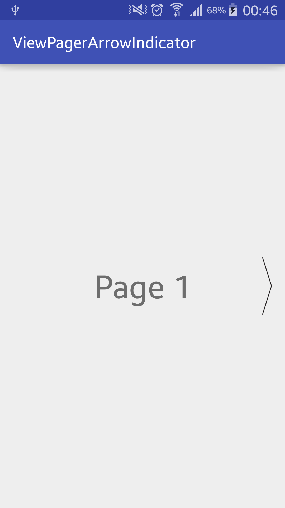
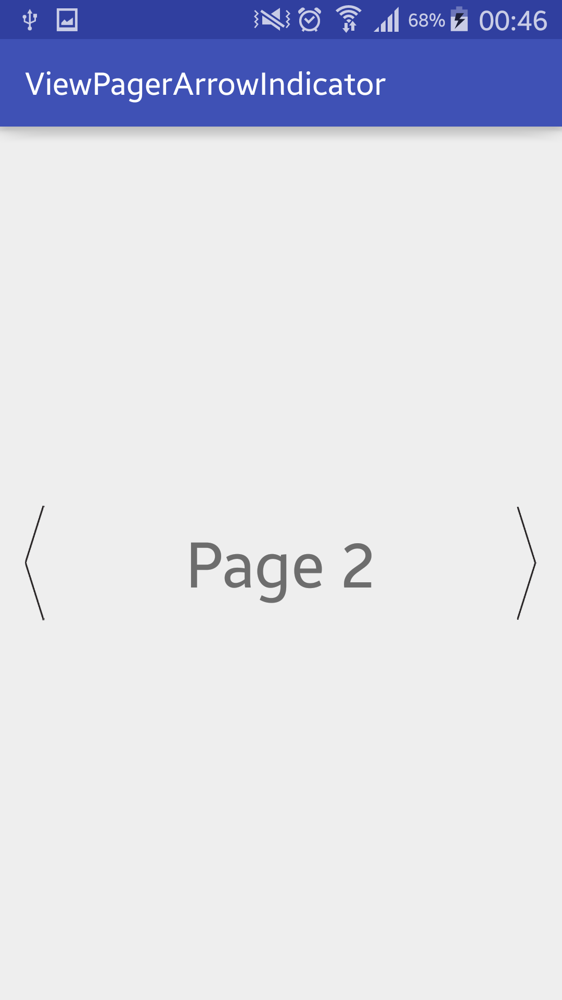
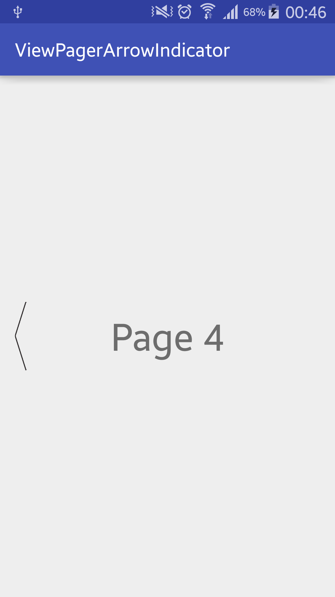

# ViewPagerArrowIndicator

[](https://android-arsenal.com/details/1/2938)

A simple viewpager indicator that uses arrows on the left and right. You can navigate viewpager by clicking arrows and customize them as well.


### Screenshots
  

## How to add
ViewPagerArrowIndicator is published with [JitPack.io](https://jitpack.io).
To add this library to your project, add these lines to your build.gradle

```
repositories {
  maven { url "https://jitpack.io" }
}

dependencies {
  compile 'com.github.sembozdemir:ViewPagerArrowIndicator:1.0.0'
}
```


## How to use
#### It is so simple. Just wrap your viewpager with ViewPagerArrowIndicator

```
<com.sembozdemir.viewpagerarrowindicator.library.ViewPagerArrowIndicator
    android:id="@+id/viewPagerArrowIndicator"
    android:layout_width="match_parent"
    android:layout_height="match_parent">
    
    <android.support.v4.view.ViewPager
        android:id="@+id/viewPager"
        android:layout_width="match_parent"
        android:layout_height="match_parent" />

</com.sembozdemir.viewpagerarrowindicator.library.ViewPagerArrowIndicator>
```

#### And then bind it in your activity, fragment etc.

```
viewPager = (ViewPager) findViewById(R.id.viewPager);
viewPagerArrowIndicator = (ViewPagerArrowIndicator) findViewById(R.id.viewPagerArrowIndicator);
viewPager.setAdapter(new MyPagerAdapter(getSupportFragmentManager()));

viewPagerArrowIndicator.bind(viewPager);
```
You have to set adapter before binding because ViewPagerArrowIndicator has to know page count of viewpager.

#### You can also customize arrows if you want. Just set your image resources.

```
viewPagerArrowIndicator.setArrowIndicatorRes(R.drawable.custom_left_arrow, 
        R.drawable.custom_right_arrow);
```

## Licence
The MIT License (MIT)

Copyright (c) 2015 Semih Bozdemir

Permission is hereby granted, free of charge, to any person obtaining a copy
of this software and associated documentation files (the "Software"), to deal
in the Software without restriction, including without limitation the rights
to use, copy, modify, merge, publish, distribute, sublicense, and/or sell
copies of the Software, and to permit persons to whom the Software is
furnished to do so, subject to the following conditions:

The above copyright notice and this permission notice shall be included in all
copies or substantial portions of the Software.

THE SOFTWARE IS PROVIDED "AS IS", WITHOUT WARRANTY OF ANY KIND, EXPRESS OR
IMPLIED, INCLUDING BUT NOT LIMITED TO THE WARRANTIES OF MERCHANTABILITY,
FITNESS FOR A PARTICULAR PURPOSE AND NONINFRINGEMENT. IN NO EVENT SHALL THE
AUTHORS OR COPYRIGHT HOLDERS BE LIABLE FOR ANY CLAIM, DAMAGES OR OTHER
LIABILITY, WHETHER IN AN ACTION OF CONTRACT, TORT OR OTHERWISE, ARISING FROM,
OUT OF OR IN CONNECTION WITH THE SOFTWARE OR THE USE OR OTHER DEALINGS IN THE
SOFTWARE.
